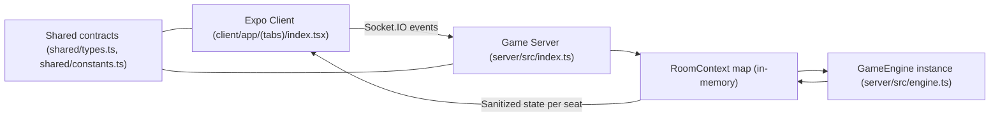
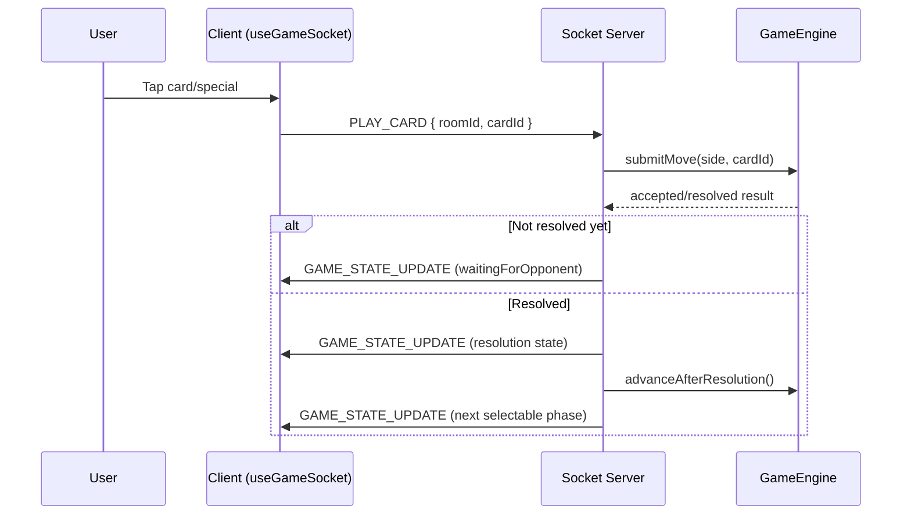

# 01: System Overview

This document explains how the current FootBored prototype is wired from top to bottom.

## Monorepo Layout

- `client/`
  - Expo Router app (web + iOS + Android), including the gameplay UI.
- `server/`
  - Node + Express + Socket.IO authoritative game server.
- `shared/`
  - Shared TypeScript types and constants used by both client and server.
- Root docs and scripts:
  - `README.md`, `ROADMAP.md`, `FOOTBORED_RULES.md`, `ASSUMPTIONS.md`
  - `scripts/validate-all.sh`, `scripts/playtest-web.sh`, `scripts/trace-state.sh`

## Runtime Topology

## High-Level Design Rules

- Server is authoritative:
  - Gameplay is resolved only in `GameEngine`.
- Client is intent + render:
  - Client sends actions and displays state, but does not own truth.
- Contracts are shared:
  - Client/server speak via `shared/types.ts`.
- Deterministic outcomes:
  - Engine uses hash-derived deterministic selection seeded from room + game state context.

## Game Session Modes

- Multiplayer:
  - Two sockets occupy `home`/`away` seats in a room.
- Bot quick play:
  - One human joins with `quickPlayBot: true`.
  - Server reserves opposite seat as bot and auto-submits bot moves.

## Room Lifecycle (Current)

- Room storage is in-memory (`Map<string, RoomContext>` in `server/src/index.ts`).
- Rejoin tokens are server-memory only.
- Stale disconnected sessions are cleaned using TTL (`REJOIN_TTL_MS`).
- No database persistence yet:
  - Restarting server loses all room/session/game history.

## Full Play Lifecycle

## What "Authoritative Engine" Means Here

- Only the server can:
  - Validate legal moves by phase and role.
  - Resolve all random/weighted outcomes.
  - Apply clock, scoring, down-distance, possession transitions.
  - Enforce overtime and conversion rules.
- Client cannot:
  - Force score changes.
  - Bypass turn order.
  - Directly mutate field/down/clock.

## Code Entry Points

- Server process boot:
  - `server/src/index.ts` -> `createGameServer()`
- Engine creation per room:
  - `createRoomContext(roomId)` -> `new GameEngine(roomId)`
- Client app root:
  - `client/app/_layout.tsx`, tabs layout in `client/app/(tabs)/_layout.tsx`
- Gameplay screen:
  - `client/app/(tabs)/index.tsx`
- Socket client abstraction:
  - `client/hooks/use-game-socket.ts`

## TypeScript Primer for This Codebase (JS/Frontend Lens)

- Shared interface-first contracts:
  - `ServerGameState`, `ClientGameState`, `JoinGamePayload`, etc.
- Narrow string unions:
  - `PlayType`, `GamePhase`, `ConversionType` prevent invalid values.
- Derived types:
  - Server narrows to specific subsets (for example standard plays vs special plays).
- Strongly typed flags:
  - `lastPlay.flags` carries structured metadata for UI and tests.

## Practical Mental Model

- Treat `server/src/engine.ts` as the game "CPU".
- Treat `server/src/index.ts` as the multiplayer "session and transport layer".
- Treat `client/app/(tabs)/index.tsx` as the "view/controller shell".
- Treat `shared/types.ts` as the "wire protocol".
