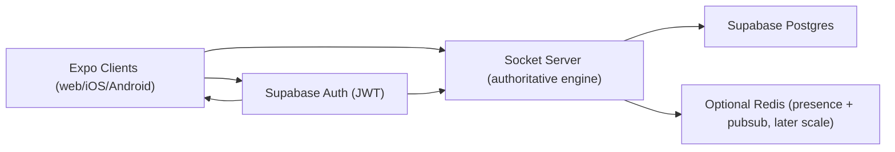

# 07: Roadmap to Supabase Auth, Invites, and Production Multiplayer

This document turns the current prototype into a concrete next-step plan.

Goal:
- user accounts
- persistent identities
- private games and invite flows
- reconnect/resume across server restarts
- same codebase serving web + iOS + Android via Expo

## Current Baseline (What You Already Have)

- Real-time authoritative engine with deterministic logic.
- Room and seat management with token-based reconnect (memory only).
- Bot quick-play and multiplayer room code joins.
- Shared contracts between client/server.
- Good gameplay and regression test coverage.

What is missing for productization:

- real user auth
- persistent storage
- durable room/match state
- invite primitives
- permission model for room access

## Target Architecture (Recommended)

Design principle:
- Keep engine authority on your Node server.
- Use Supabase for identity, persistence, and relational queries.

## Phase Plan

## Phase 1: Identity and Session Foundation

Deliverables:

1. Supabase project setup (dev first).
2. Email/password or magic-link auth in Expo client.
3. Client obtains Supabase session JWT.
4. Socket `JOIN_GAME` includes auth token.
5. Server verifies token and maps to stable `user_id`.

Server changes:

- replace anonymous seat identity with:
  - `userId` (from Supabase)
  - `displayName` (profile table)
- still allow guest mode behind feature flag if desired.

## Phase 2: Database Schema and Persistence

Suggested initial tables:

1. `profiles`
   - `id uuid pk` (matches Supabase auth user id)
   - `username text unique`
   - `created_at timestamptz`
2. `rooms`
   - `id uuid pk`
   - `code text unique`
   - `status text` (`LOBBY`, `IN_PROGRESS`, `FINISHED`)
   - `created_by uuid`
   - `created_at`
3. `room_members`
   - `room_id uuid`
   - `user_id uuid`
   - `seat text` (`home`, `away`, `spectator`)
   - `joined_at`
4. `matches`
   - `id uuid pk`
   - `room_id uuid`
   - `engine_version text`
   - `state_json jsonb` (serialized `ServerGameState`)
   - `status text`
   - `created_at`, `updated_at`
5. `invites`
   - `id uuid pk`
   - `room_id uuid`
   - `created_by uuid`
   - `invite_code text unique`
   - `expires_at timestamptz`
   - `max_uses int`
   - `uses int`

Storage approach:

- Persist match snapshots at safe checkpoints:
  - post-resolution
  - reset/rematch
  - disconnect events
- Keep in-memory engine for active gameplay speed.

## Phase 3: Invite and Room Product Flow

User flow:

1. Authenticated user creates room.
2. Server creates DB room + invite code.
3. User shares invite link/code.
4. Friend opens app, signs in, enters code.
5. Server validates invite and assigns seat.

Recommended invite link shape:

- `footbored://join/<inviteCode>` (native deep link)
- `https://yourdomain.com/join/<inviteCode>` (web)

Expo notes:

- use `expo-linking` to parse incoming links.
- prefill join flow in `index.tsx` state.

## Phase 4: Reconnect and Resume Hardening

Today reconnect works only while process memory survives.

Upgrade path:

1. On socket join:
   - load active room/match snapshot for user from DB.
2. Rehydrate `GameEngine` from persisted `state_json`.
3. Resume with same room code + seat ownership.
4. Add server guardrails for stale/expired rooms.

Data integrity rule:

- server should persist a monotonic `state_version` with each save to avoid last-write clobbering.

## Phase 5: Presence, Scale, and Ops

Once basic product flow is stable:

1. Add Redis for:
   - distributed room locks
   - cross-instance socket pubsub
   - short-lived presence
2. Add structured logging around:
   - join failures
   - move rejects
   - disconnect reasons
3. Add metrics:
   - active rooms
   - completion rate
   - reconnect success rate

## Phase 6: UX Productization for Expo Platforms

Web:
- lobby polish and copy clarity
- shareable invite URLs

iOS/Android:
- deep-link join
- push notifications for invite accepted / opponent joined (later)

Keep one gameplay UI code path where possible.

## API and Contract Changes You Will Need

## New join payload shape (example)

Current:
- `JoinGamePayload` has roomId/token/quickPlay metadata.

Future extension:
- `authToken` (or rely on socket auth handshake)
- `inviteCode` optional
- `resumeMatchId` optional

## New server ack fields (example)

- `userId`
- `roomStatus`
- `canResume`
- `inviteAccepted`

## Security Rules

Minimum rules for production:

1. Server verifies Supabase JWT on connect/join.
2. Only room members can submit `PLAY_CARD`.
3. Seat claims are enforced by DB-backed room membership.
4. Invite creation/rotation requires authenticated owner or member role.

## Suggested Implementation Order (Most Practical)

1. Add Supabase auth to client + token verification in server.
2. Persist rooms and room members.
3. Persist active match snapshot after each resolution.
4. Add invite codes and deep-link join.
5. Add resume-on-restart.
6. Then add scale infrastructure (Redis/multi-instance).

## Migration Risk and Mitigation

Risk:
- changing join identity semantics can break reconnect flow.

Mitigation:
- introduce auth in parallel with existing room token logic.
- support both for one transition period.
- add dedicated reconnect tests for authenticated sessions.

Risk:
- persistence can introduce state skew vs in-memory engine.

Mitigation:
- make engine state serialization deterministic.
- persist only at strict lifecycle points.
- add replay trace checks before and after persistence loads.

## What to Build First This Week

If you want immediate momentum:

1. Implement Supabase auth in client.
2. Add socket auth verification on server.
3. Add `profiles` table and store username.
4. Add `rooms` + `room_members` persistence for join/create.
5. Keep match state in memory for now, but persist room membership immediately.

That gets you from experiment to real-user multiplayer foundation without overcommitting too early.
